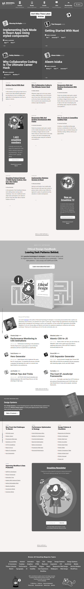

# Tear-down Design -- Heatmap of the Smashing Magazine Home Page 

> The Objctive of this project is to create a Heatmap of the smashing magazine homepage using grayscale color.

Additional description about the project and its features.

## Built With

- HTML,
- CSS

## Live Demo

[Go Live Demo](https://rawcdn.githack.com/keddo/apple_page/a28c906ecf97455eae8f359a5139c11f86bbfc6c/index.html)

## Getting Started

**This is an example of how you may give instructions on setting up your project locally.**
**Modify this file to match your project, remove sections that don't apply. For example: delete the testing section if the currect project doesn't require testing.**

To get a local copy up and running follow these simple example steps.

### Setup
> Clone the project into you directory and open it.

## Authors

👤 **Kedir**

- Github: [@keddo](https://github.com/keddo)
- Twitter: [@kedirman](https://twitter.com/kedirman)
## 🤝 Contributing

Contributions, issues and feature requests are welcome!

Feel free to check the [issues page](issues/).

## Show your support

Give a ⭐️ if you like this project!

## Acknowledgments

- Hat tip to anyone whose code was used
- Inspiration
- etc

## 📝 License

This project is [MIT](lic.url) licensed.